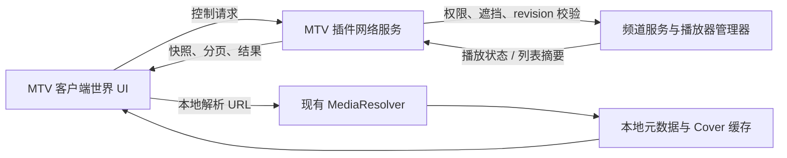

# MTV 世界屏幕播放器 UI 升级设计

## 目标

将 MTV 从“客户端仅接收频道快照、控制完全依赖服务端容器 GUI”的模式，升级为世界内播放器控制体验。

玩家用准星接近 MTV 显示器右下角时，显示悬浮的展开按钮；左键按钮后，在同一块世界屏幕上显示简洁的 MPV 风格控制 UI。UI 支持播放、进度、播放列表和主音量等媒体控制。所有实际状态仍由服务端维护并校验，客户端只承担渲染、交互、媒体元数据解析和本地播放同步。

本设计只修改 `McediaTV`。不修改 `McediaCore` 的 API、播放器、渲染器或网络协议。

## 范围

### 本期包含

- 世界空间的 MTV 播放器控制 UI。
- 准星射线命中、悬浮展开按钮、左键控制和可拖动进度条。
- 播放/暂停、上一首/下一首、绝对跳转、播放速度、播放模式、主音量和静音。
- 共享频道播放列表的分页浏览、播放、添加、删除、前移、后移和清空。
- 全屏链接添加界面：本地解析、信息预览和确认提交。
- 客户端的标题、作者、描述、平台和 Cover 异步解析与缓存。
- 服务端权限、UUID、频道绑定、世界一致性、方块遮挡、revision 和限流校验。
- 带宽受控的频道状态同步、播放列表分页和 UI 状态观察。

### 本期不包含

- 屏幕或扬声器的位置、偏移、旋转、尺寸、亮度、填充模式、音频范围和单扬声器音量编辑。
- 公共频道创建、频道发现、频道所有权等管理功能向世界 UI 的迁移。
- Core 的公共 UI 或通用世界 GUI 框架。
- 服务端存储或信任客户端解析出的标题、描述、Cover 等元数据。

外设配置继续由现有 Bukkit 容器 GUI 管理。世界 UI 的音量只修改 MTV 播放器的 `masterVolume`；单个扬声器音量仍在容器 GUI 中维护。

## 架构

共享逻辑和协议放在 `mcedia-mtv` 主源码；服务端处理放在 `mcedia-mtv-plugin`。各 Minecraft 版本目录只实现与该版本相符的渲染挂接、世界射线输入拦截和纹理上传，不引入 Core 改动。

客户端新增以下职责：

- `worldui`：屏幕几何、世界渲染、布局、命中测试、交互状态和输入拦截。
- `metadata`：URL 规范化、本地异步解析、Cover 下载和有界缓存。
- `channel`：新增载荷编解码、分页缓存、控制请求、观察状态和协议兼容。

服务端新增以下职责：

- 统一的控制请求处理器，复用 `MtvChannelService`、`MtvPlaybackController`、`MtvPlayerManager` 的既有领域操作。
- 播放列表 manifest 和按需分页服务。
- 目标 MTV 的可见性、权限、版本和限流校验。
- 展开世界 UI 客户端的轻量控制状态观察器。

## 状态边界

### 服务端权威状态

- 频道播放状态：当前 URL、暂停状态、速度、时间锚点、时长和频道 revision。
- 播放列表：URL 条目、游标和播放模式。
- MTV 播放器状态：UUID、频道绑定、`masterVolume`、屏幕和扬声器配置。
- 权限、频道公开控制策略和实体世界位置。

频道使用一个单调递增的 revision 作为播放和播放列表变更的并发版本。播放器 `masterVolume` 是实体状态，不改变频道 revision。

### 客户端本地状态

- 当前命中的 MTV、屏幕 ID、局部 UV、折叠/展开状态、悬浮热区和拖拽预览值。
- 当前正在等待的控制请求及其 `requestId`。
- 分页播放列表的稀疏页缓存。
- 按规范化 URL 键控的媒体元数据和 Cover 纹理缓存。
- 全屏添加媒体界面的输入文本、解析任务和预览结果。

鼠标移动、准星悬停、展开/收起、进度预览、元数据和 Cover 状态均为本地状态，绝不写回服务端。

## 协议

所有载荷沿用 `mcedia_mtv` 命名空间，并使用 `FriendlyByteBuf` 的显式长度、字符串和枚举校验。每个解码器必须拒绝尾随字节、超长字符串、负数索引、非法 UUID、未知操作和不完整消息。

### 能力协商

`mcedia_mtv:world_ui_capabilities` 由新插件在客户端订阅频道后发送给已注册该载荷的客户端，包含协议版本、最大页面项数和功能位。

新客户端在未收到能力包前继续使用现有拉取播放逻辑，但不显示可控制的世界 UI。这样新客户端连旧插件时不会发送未被处理的控制包，旧客户端连新插件时也不受影响。

### 播放列表分页

完整播放列表不能放入单个自定义载荷。新增三种消息：

| 载荷 | 方向 | 字段 | 用途 |
| --- | --- | --- | --- |
| `channel_playlist_manifest` | S2C | channelId、revision、itemCount、cursor、playOrderMode | 首次订阅、列表变更和 revision 失配后的轻量摘要。 |
| `channel_playlist_page_request` | C2S | channelId、knownRevision、offset | 请求某一页。 |
| `channel_playlist_page` | S2C | channelId、revision、itemCount、cursor、playOrderMode、offset、URL 列表 | 返回按需页面。 |

页面最多 32 项，并且编码内容最多 24 KiB；服务端在达到任一上限前停止加入条目。单个播放 URL 最大 2048 个字符，超限 URL 不允许写入播放列表。客户端只预取当前可见页、当前播放项所在页及相邻一页；对同一页的请求去重，并限制在途请求数。

当服务器修改列表时，向已订阅频道的客户端广播 manifest，而不广播完整列表。客户端收到更新 revision 后丢弃旧页缓存并重新请求可视页；按 URL 键控的媒体元数据缓存继续复用。

第一期条目仍是 `ChannelPlaylistItem(String mediaUrl)`，列表操作使用“索引 + expectedRevision”。并发编辑使 revision 不一致时，服务器拒绝操作并回传最新 manifest，客户端刷新后由用户再次操作，避免错误地修改移动后的条目。

### 控制请求与结果

`mcedia_mtv:channel_control_request` 字段如下：

- `targetMtvUuid`：目标 MTV 实体 UUID。
- `screenId`：被命中的屏幕外设 ID。
- `channelId`：客户端预期绑定的频道。
- `requestId`：客户端生成的递增请求标识。
- `expectedRevision`：播放和列表操作使用的频道 revision。
- `hitU`、`hitV`：准星命中或控件锚点的屏幕局部坐标。
- `operation` 与受严格长度/范围校验的参数。

操作枚举为：

`TOGGLE_PAUSE`、`SEEK_ABSOLUTE`、`SEEK_RELATIVE`、`SET_SPEED`、`PLAY_INDEX`、`NEXT`、`PREVIOUS`、`PREPEND`、`APPEND`、`INSERT_NEXT`、`INSERT_AND_PLAY`、`REMOVE`、`MOVE_FRONT`、`MOVE_BACK`、`CLEAR`、`SET_PLAY_ORDER`、`SET_MASTER_VOLUME`、`TOGGLE_MUTE`。

静音是客户端界面状态：点击静音时保存本地的非零音量，并向服务端将 `masterVolume` 设为 0；再次点击恢复保存值。服务器不单独保存“静音”布尔值。

`mcedia_mtv:channel_control_result` 仅回给发起者，包含 `requestId`、接受/拒绝结果、错误码和最新 revision。服务器成功执行后，继续使用现有频道快照广播链路向已订阅观众发布新播放状态；列表操作额外广播新的 manifest。

### UI 控制状态观察

世界 UI 展开时，客户端发送 `world_ui_watch`，关闭时发送 `world_ui_unwatch`。每个玩家最多观察一个 MTV；服务端在玩家退出、目标消失或显式取消时清理观察。

`world_ui_control_state` 只在开始观察、`masterVolume` 实际变化或播放器可控制状态变化时发送给观察者，包含 MTV UUID、当前绑定频道、主音量和权限结果。它不包含播放列表或逐帧进度。

不使用观察心跳；连接断开会由现有玩家退出清理，客户端切换目标时显式取消旧观察。这避免为纯 UI 展示引入周期包。

## 服务端校验与安全

客户端的准星结果不是可信输入。所有 `channel_control_request` 必须按以下顺序校验：

1. 请求长度、字段范围和每玩家限流。
2. `targetMtvUuid` 对应的 MTV 存在，`screenId` 存在，且目标的当前频道绑定等于 `channelId`。
3. 请求玩家与目标 MTV 位于同一世界。
4. 调用现有 `canControlChannelPlayback` 规则校验所有权、公开频道和权限。
5. 由服务端根据 MTV 位置、屏幕偏移、屏幕尺寸和屏幕旋转，将 `hitU`/`hitV` 重新换算为世界坐标。客户端提交的世界坐标一律忽略。
6. 从玩家眼睛到该世界坐标执行方块射线检测。存在不可穿透方块遮挡时拒绝请求。
7. 对频道 revision、列表索引、URL、速度、音量和时间位置进行最终领域校验，再调用既有服务修改状态。

不设置固定交互距离。只要玩家有权限、处于同一世界且服务端验证的屏幕命中点没有方块遮挡，就可以控制。客户端可见的局部小按钮使用同一屏幕几何换算，以确保遮挡规则一致。

默认限流配置：每玩家每秒最多 10 个控制请求、4 个页面请求和 2 个观察切换；达到限制时返回 `RATE_LIMITED`，不改动状态。上述阈值配置化，且服务端忽略重复的音量/模式更新。

## 世界 UI

### 屏幕几何与渲染

MTV 为已加载的 MTV 屏幕计算与播放器外设相同的世界平面。每帧只做本地渲染和一次必要的准星射线相交，取得最近的、正面可见屏幕以及局部 UV 坐标。UI 在该平面上绘制，因此会自然继承屏幕的旋转、缩放、深度遮挡和光照处理。

Core 现有的被动进度条不承担 MTV 世界 UI 的进度控制。升级迁移时，MTV 将其管理的屏幕 `progressBarVisible` 配置设为 `false`，由 MTV 渲染自己的可拖动进度条，避免两条进度条重叠；此举仅改变 MTV 发给现有 Core 外设的配置，不修改 Core 代码。

布局使用归一化屏幕坐标和最小世界热区尺寸。屏幕过小或纵横比异常时，自动降级为传输控件、可拖动进度条和队列入口，不绘制会互相遮挡的详情文字。

### 折叠状态

折叠时不绘制控制面板。准星进入屏幕右下角外侧的触发区时，在屏幕边缘浮现小型展开图标；准星离开触发区和按钮后淡出。左键命中该按钮展开 UI；展开时该位置变为收起按钮，点击后恢复折叠。

这是纯世界射线交互：不打开独立鼠标模式，不释放光标，不改变玩家视角控制。命中 MTV UI 热区的左键会取消原版攻击或放置；点击视频空白处保持原版行为。

### 展开状态

视觉遵循 MPV 的简洁风格：黑灰半透明底色、直角、细边线、单色图标、紧凑排版和有限动画，不覆盖整块视频。

- 底部控制条：上一首、播放/暂停、下一首、时间文本、可拖动进度条、播放模式、静音和主音量。
- 左上信息：当前媒体的小 Cover、标题和作者。
- 右侧队列入口：点击后在同一屏幕右侧展开播放列表面板。
- 列表项：序号、Cover、标题和时长；当前播放项高亮。左键条目播放该项；悬浮时显示下一首播放、上移、下移和删除图标。
- 列表顶部：加入链接、清空、播放模式切换。加入链接后先选择首加、下一个加、尾加或插入后立即播放，确保与容器 GUI 的既有媒体加入方式对齐。
- 描述仅在当前条目详情或队列详情区域显示，避免覆盖视频。

进度条按住时，根据准星在屏幕平面上的位置仅更新本地预览；松开左键后才发送一次 `SEEK_ABSOLUTE`。音量条也只在松开时发送最终的 `SET_MASTER_VOLUME` 值。鼠标移动和拖动过程不会产生网络包。

## 全屏媒体添加界面

在世界播放列表中点击加入图标后，打开 MTV 自己的全屏客户端 UI，而不是在世界屏幕中输入长链接。

1. 中央输入框支持键盘输入和粘贴，提供取消与确认。
2. 文本变化经过短暂防抖后，在后台调用已注册的 `MediaResolver`；不向服务器发解析请求。
3. 解析成功后预览 Cover、标题、作者、描述、平台和规范化 URL；解析失败时显示明确的本地错误。
4. 仅解析成功时允许确认。确认时发送规范化 URL、插入方式（首加、下一个加、尾加或插入后立即播放）、目标 MTV UUID、屏幕 ID 和打开界面时的 playlist revision。
5. 成功后关闭全屏界面，回到世界播放列表并等待新的 manifest；拒绝、权限不足或 revision 过期时保留输入和预览，展示错误并允许刷新后重试。

该界面沿用世界 UI 的 MPV 风格，但作为标准全屏客户端界面处理键盘焦点和粘贴。预览信息只用于本地显示，服务端只保存并校验 URL。

## 客户端元数据与 Cover

`MtvMediaMetadata` 是 MTV 内部类型，字段为规范化 URL、标题、作者、描述、平台、Cover URL、解析状态和错误原因。它不扩展或修改 Core 的 `MediaInfo`。

- 标题、作者、平台来自现有 resolver 的 `MediaInfo`。
- 描述优先从 `MediaInfo.extraMetadata` 的约定键读取；缺失时为空字符串。
- Cover URL 来自 `MediaInfo.coverUrl`。
- 缓存以规范化 URL 为键，并设置容量上限和 LRU 淘汰；不持久化 Cookie、请求头或受认证播放 URL。
- 仅解析当前播放项、当前可视页和相邻页；不因长播放列表一次性创建网络请求。
- 解析任务、Cover 下载和图片解码运行在后台受限执行器；GL 纹理上传和释放在渲染线程执行。
- Cover 下载有连接/读取超时、响应字节数、图片尺寸和并发数上限。失败时使用 MTV 默认 Cover，不影响视频播放。
- URL 不受当前客户端 resolver 支持时，队列展示截断 URL、默认 Cover 和失败状态；添加流程则不允许确认。

## 同步与带宽策略

渲染帧率不影响服务器网络负载。

- 客户端根据最近一次权威播放时间锚点、速度和本地单调时钟估算进度。
- 保留现有“状态变更立即推送 + 有活跃观众时约 5 秒低频校时”模型；不增加逐帧进度包。
- 频道快照仅发给已订阅且活跃的观众。
- 播放列表仅在首次订阅、列表 revision 变化或请求未缓存页时通信，且按页返回。
- 控制请求仅在离散操作或滑条释放时发送；结果仅回给发起者。
- 世界 UI 观察只在展开/关闭和相关状态变化时通信；悬停、拖拽、鼠标移动、Cover 和元数据不通信。
- 对页面、URL、字符串、列表总数、并发下载和请求频率设置上限，并记录被拒绝原因用于诊断。

## 错误处理

控制结果使用稳定错误码：`UNSUPPORTED_CLIENT`、`MALFORMED_REQUEST`、`TARGET_NOT_FOUND`、`SCREEN_NOT_FOUND`、`CHANNEL_MISMATCH`、`WORLD_MISMATCH`、`OCCLUDED`、`PERMISSION_DENIED`、`STALE_REVISION`、`INVALID_ARGUMENT`、`RATE_LIMITED`、`INTERNAL_ERROR`。

客户端行为如下：

- `STALE_REVISION`：清除旧列表页，请求最新 manifest 和可视页；不本地猜测合并结果。
- `OCCLUDED`、`PERMISSION_DENIED`、`TARGET_NOT_FOUND`：停止 pending 状态，保留 UI 并显示错误。
- 页面请求失败：保留已缓存的其他页，允许重试。
- 元数据或 Cover 失败：不影响频道播放和控制。
- 连接断开：销毁世界 UI 观察、频道页缓存和临时纹理；URL 元数据缓存可在同一客户端会话内继续复用。

## 测试与验收

### 单元测试

- 所有新增载荷的编解码、尾随字节、字段边界和恶意长度拒绝。
- 页面 32 项/24 KiB 边界、空列表、超长 URL、最后一页和 revision 失配。
- 控制操作的并发 revision、索引边界、首加/下一个加/尾加/插入后立即播放、重复请求和限流。
- UUID、频道绑定、世界一致性、屏幕局部坐标换算和方块遮挡验证。
- 元数据缓存去重、LRU 淘汰、解析超时、Cover 超限、下载失败和渲染线程纹理释放。
- 世界 UI 的 UV 命中、右下角按钮显示/隐藏、控件热区、折叠/展开和进度拖拽映射。

### 集成与手工验证

- 新客户端/新插件：完整世界 UI、分页、链接预览、多人并发控制和遮挡拒绝。
- 新客户端/旧插件：保持既有播放，世界控制 UI 不显示。
- 旧客户端/新插件：保持既有频道播放和容器 GUI 行为。
- 容器 GUI 与世界 UI 同时修改同一频道：服务器状态一致，过期请求被安全拒绝。
- 大播放列表、低带宽、丢包、Cover 失败和高帧率下确认没有逐帧网络流量。
- 1.21.8、1.21.11、26.1、26.2 分别构建并验证版本适配层。

## 迁移

1. 先发布同时包含能力协商和旧协议兼容的新插件与客户端。
2. 插件迁移其管理屏幕的 `progressBarVisible=false`，让 MTV 的控制进度条成为唯一的可见进度条。
3. 旧容器 GUI 保留所有现有功能；本期只有媒体控制类操作在世界 UI 中新增入口。
4. 在至少一个稳定版本后，根据使用反馈决定是否将更多容器菜单功能迁移到世界 UI。

## 完成标准

- 不修改 McediaCore。
- 世界 UI 能在 MTV 屏幕上展开、收起、播放、跳转、调整主音量和管理共享播放列表。
- URL 添加必须经过客户端本地解析和信息预览。
- 长播放列表不产生超大单包，且客户端不会全量解析。
- 遮挡显示器、伪造 UUID、伪造世界坐标、过期 revision 和高频刷包不能改变服务端状态。
- 没有任何鼠标移动、悬停、拖拽预览、逐帧进度或元数据解析同步到服务器。
- 原有容器 GUI 和既有播放兼容路径保持可用。
